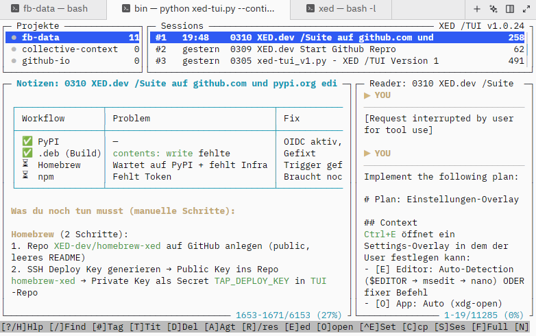

# XED /TUI

**Browse, search and resume your Claude Code sessions — right in the terminal.**

> 🇩🇪 Deutsche Version: [de/README.md](de/README.md)

<!--
  Screenshot placeholder — add after taking terminal screenshots:
  
-->

Claude Code stores every conversation as a local file. XED /TUI makes them
accessible: search across all sessions, read full transcripts with Markdown
rendering, write notes, and jump back into any session with one keystroke.

## Install

```bash
curl -fsSL https://tui.xed.dev/install.sh | bash
```

Requires: Claude Code · Python 3.11+ · Linux, macOS, or WSL

**Alternative methods:**
```bash
pipx install xed-tui
uv tool install xed-tui
brew install xed-dev/xed/xed-tui
```

## 30-Second Demo

```bash
xed-tui          # start
```

| Key | Action |
|-----|--------|
| `↑↓` | Browse sessions |
| `Enter` | Read full transcript |
| `/` | Search across all sessions |
| `a` | Resume session in Claude Code |
| `e` | Write a note |
| `?` | Help (DE / EN / FR / JA / ES) |

→ Full reference: [docs/keybindings.md](docs/keybindings.md)

## Why XED /TUI?

| Feature | XED /TUI | claude-dashboard | claude-session-browser |
|---------|----------|-----------------|----------------------|
| Zero dependencies | ✅ Python stdlib only | ❌ Go binary | ❌ Go binary |
| Per-session notes | ✅ Smart sync | ❌ | ❌ |
| Full-text search | ✅ Live filter | ✅ | ✅ |
| Markdown rendering | ✅ bold, code, tables | ❌ raw text | ❌ raw text |
| Multi-language help | ✅ DE/EN/FR/JA/ES | ❌ | ❌ |
| Resume with one key | ✅ `a` → `--resume` | ✅ | ✅ |
| Install time | ~5 sec (pip) | requires Go | requires Go |

## Features

- **4-Panel Layout** — Projects · Sessions · Reader · Notes (side-by-side)
- **`a` Resume** — start Claude Code with `--resume <uuid>` (CWD automatic)
- **`r` Clipboard** — copy `/resume <uuid>` for a running Claude Code instance
- **`e` Notes** — per-session `memory/<uuid>.md`, editable in any editor
- **`/` Search** — live search across titles and notes
- **`#` Tags** — label sessions, filter by tag (`/#bugfix`)
- **`Ctrl+R`** — hot-reload, state preserved via `--continue`

→ Full guide: [Wiki](https://github.com/XED-dev/TUI/wiki) ·
[Quickstart](docs/quickstart.md) ·
[Discussions](https://github.com/XED-dev/TUI/discussions)

## Contribute

All languages welcome · Alle Sprachen willkommen.

→ [CONTRIBUTING.md](CONTRIBUTING.md) · [Issues](https://github.com/XED-dev/TUI/issues)

---

**Version:** v1.0.24 · **License:** MIT · **Org:** [Collective Context](https://collective-context.org) · **PyPI:** [xed-tui](https://pypi.org/project/xed-tui/)
